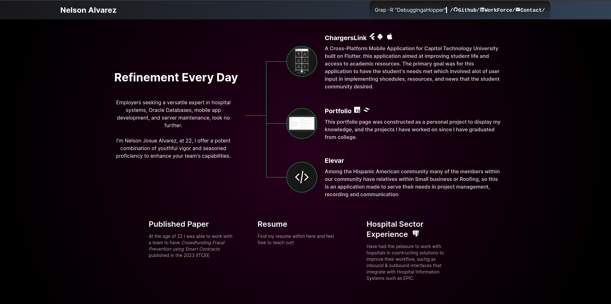

This is HoppingPortfolio my personal Portfolio Page

# How does the website look
As you can see the current version of the websiote looks like the following



## Howe i designed the page
The core desing of the page is extremely simple, what we will have are two pages 

1. Main Page: This page will contain the following core elements of my portfolio Page
   - Navigation Bar : This is made in a manner similar to a directory
   - projects & introduction: This will be in the center where I introcuce who I am alongside the projects  have worked on in the past
   - Achievements & Resume, This will display my achievements in what I have been able to accomplish

2. Resume Viewer: this will allow the user to view my resume

## Pages

We have three core pages:
 - Navigation ```index.tsx``` : Located in the components/navbar folder
 - Main  ```page.tsx``` : located in the app folder
 - Resume ```Viewer page.tsx``` : located in the PDF
  
## Desired updates

What i would like to add is to ensure that the navigation bar does not overlap with the rest of the page.

